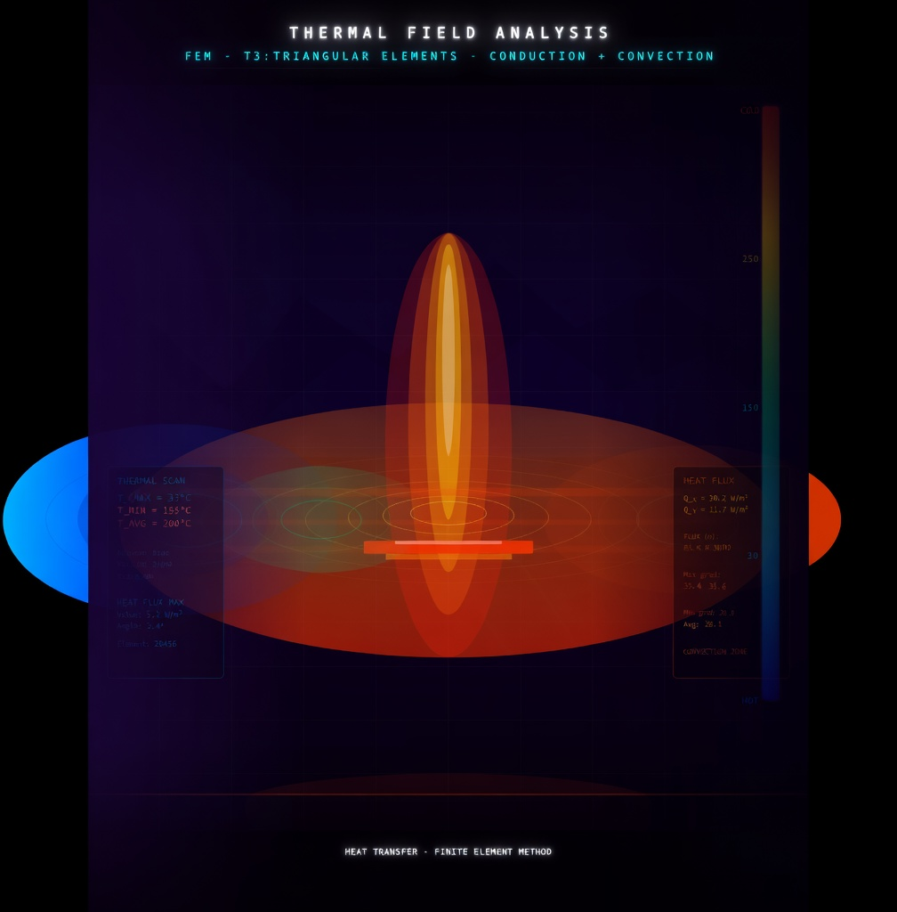

# 🌡️ 2D Heat Conduction FEM Solver in MATLAB

<p align="center">
  
</p>

<p align="center">
  
  
  
  
</p>

---

## 📌 Overview

A complete **Finite Element Method (FEM)** solver for the **2D steady-state heat conduction equation**, built entirely in **MATLAB App Designer**. The app discretizes complex L-shaped geometries using **T3 (linear triangular) elements**, assembles global stiffness matrices with both conduction and convection contributions, enforces Dirichlet and Robin boundary conditions, and visualizes the resulting temperature distribution as an interactive color-mapped patch plot.

The solver also includes two **real-world engineering applications** — chip cooling and building wall heating — each running the same FEM pipeline with scenario-specific physics parameters.

---

---

## 👨‍💻 Authors

| Arnob Pal |
| Ziaur Rahman Zihan |

**Supervised by:**  
Dr. Maruf Ahmed, Assistant Professor, Department of EEE, BUET  
Md. Kamrul Hasan, Lecturer, Department of EEE, BUET

---

## ✨ Features

- **Interactive MATLAB App Designer GUI** — enter all physical parameters directly in the UI
- **L-shaped domain mesh generation** — up to 4 rectangular blocks, each subdivided into T3 triangular elements using a center-node strategy (4 triangles per quadrilateral cell)
- **Conduction stiffness matrix** — assembled from the B matrix and isotropic material matrix [D]
- **Convection (Robin) boundary conditions** — automatically detected on exposed edges; consistent edge matrix formulation
- **Dirichlet boundary conditions** — fixed temperature applied at x = 0 (left boundary)
- **Direct solver** — global system solved via MATLAB backslash (LU decomposition)
- **Temperature colormap visualization** — smooth patch plot with colorbar
- **Two real-world application scenarios** selectable from a dropdown:
  - 🖥️ **Electronic Device (CPU) Cooling** — silicon chip with forced-air convection
  - 🏠 **Building Wall Heating** — concrete wall with interior heating and exterior cold exposure

---

## 🔬 Theory Summary

The solver addresses the **2D steady-state heat conduction PDE**:

$$\frac{\partial}{\partial x}\left(k_x \frac{\partial T}{\partial x}\right) + \frac{\partial}{\partial y}\left(k_y \frac{\partial T}{\partial y}\right) = 0$$

**FEM pipeline:**
1. Mesh generation → T3 triangular elements (3 nodes, 1 DOF per node)
2. Linear shape functions → constant gradient B matrix per element
3. Element conduction matrix: $K_c = t \cdot A \cdot [B]^T [D] [B]$
4. Convection edge matrix: $K_h = \frac{hLt}{6}\begin{bmatrix}2&1\\1&2\end{bmatrix}$ per exposed edge
5. Global assembly via steering vector
6. Dirichlet enforcement by direct substitution
7. Solve: $\{T\} = [KK]^{-1}\{f_g\}$

---

## 📁 Repository Structure

```
📦 2D-Heat-Conduction-FEM-Solver/
├── 📄 EEE_PROJECT_FROM_95_AND_96.m     # Main MATLAB App Designer source file
├── 🖼️  360_F_487461421_...png           # App background image (required)
├── 📊 Project_Report.pdf               # Full project report (BUET format)
├── 📝 Project_Report.docx              # Editable report (Word format)
├── 📽️  Presentation.pptx               # Project presentation slides
├── 🎬 Video_Script_Code_GUI_md.pdf     # Code & GUI walkthrough video script
└── 📖 README.md                        # This file
```

---

## 🚀 Getting Started

### Prerequisites
- MATLAB R2020b or later (App Designer support required)
- No additional toolboxes required

### Running the App

1. Clone or download this repository
2. Place **both** `EEE_PROJECT_FROM_95_AND_96.m` and the background image PNG **in the same folder**
3. Open MATLAB and navigate to that folder
4. Run in the Command Window:
   ```matlab
   EEE_PROJECT_FROM_95_AND_96
   ```
5. The App Designer GUI will launch

### Using the GUI

| Parameter | Description |
|---|---|
| **Thermal Conductivity** | Material thermal conductivity $k$ (W/m·K) |
| **Heat Convection Coefficient** | Convection coefficient $h$ (W/m²·K) |
| **Thickness (mm)** | Out-of-plane element thickness |
| **Number of Blocks (1–4)** | Number of rectangular L-shape blocks in the mesh |
| **Bounded Temperature (Initial)** | Fixed temperature at x = 0 boundary (°C) |

Click **"Show Plot"** to run the FEM solver and display the temperature distribution.

Use the **"Select Scenario"** dropdown and **"Run Application"** to execute a predefined real-world case.

---

## 🌡️ Real-World Applications

### 🖥️ Case 1: Electronic Device (CPU) Cooling

| Parameter | Value |
|---|---|
| Material | Silicon |
| Thermal conductivity | 148 W/(m·K) |
| Convection coefficient | 250 W/(m²·K) — forced air |
| Base temperature (heat source) | 85 °C |
| Ambient temperature | 25 °C |
| Domain | 20 mm × 10 mm |

**Result:** T_max = 85.0°C, T_min = 83.2°C — shows uniform heat spreading through the silicon substrate with surface convective cooling.

---

### 🏠 Case 2: Building Wall Heating

| Parameter | Value |
|---|---|
| Material | Concrete |
| Thermal conductivity | 1.7 W/(m·K) |
| Exterior convection coefficient | 20 W/(m²·K) |
| Interior surface temperature | 20 °C (heated room side) |
| Exterior ambient temperature | −10 °C (winter cold) |
| Domain | 300 mm thick × 1000 mm tall |

**Result:** T_max = 20.0°C, T_min = −3.4°C — captures the thermal gradient through the wall cross-section under winter conditions.

---

## 📊 Sample Results

The figures below show the temperature profile for different input parameters:

| Scenario | Behavior |
|---|---|
| High k, Low h | Heat spreads evenly across domain |
| Low k, High h | Heat confined near the source boundary |
| More blocks | Larger L-shaped domain, more mesh detail |
| 1 block only | Full rectangular domain, smooth gradient |

---

## 🛠️ Numerical Method Details

- **Element type:** T3 (3-node linear triangle), 1 DOF per node (temperature)
- **Mesh strategy:** Each quad cell split into 4 triangles via center node
- **Boundary detection:** Geometric edge-midpoint checking for convection edges
- **Solver:** MATLAB backslash operator (`\`) — LU decomposition
- **Visualization:** `patch()` with `'FaceColor', 'interp'` for smooth color interpolation

---

## 📚 References

- Standard textbooks on Heat Transfer and Finite Element Method
- MATLAB Official Documentation
- Course lecture notes & lab sheets — EEE 212, BUET
- Relevant research papers and journal articles on FEM and heat conduction

---

## 📄 License

This project was developed as an academic submission for EEE 212 at BUET. Feel free to use it as a reference for learning FEM and MATLAB App Designer.

---
